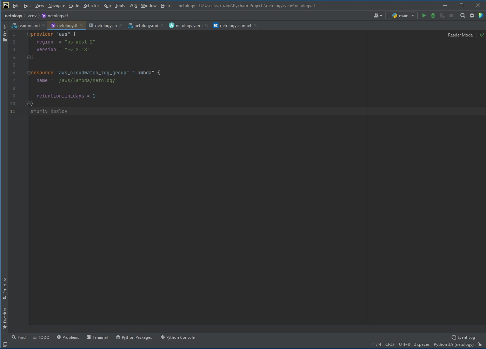
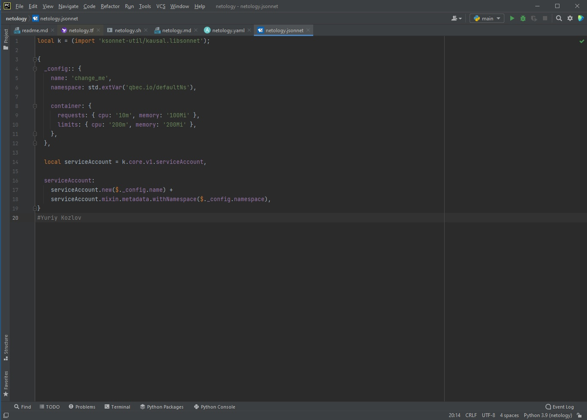
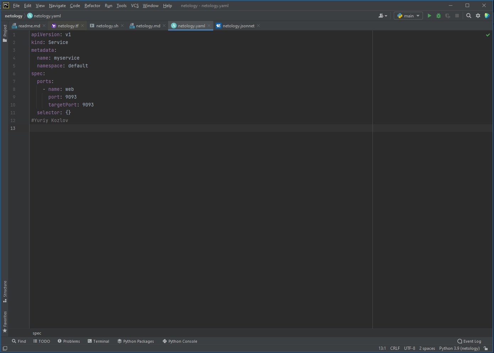
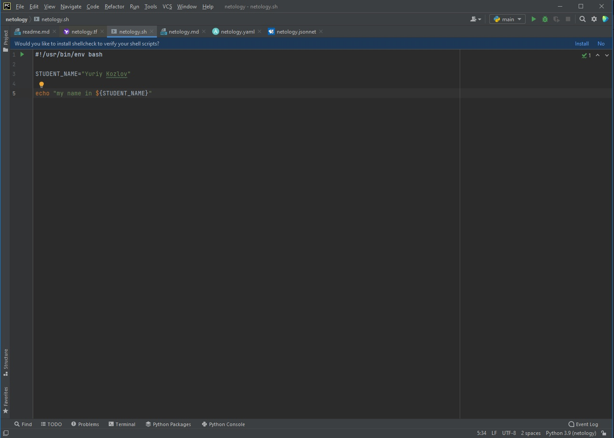
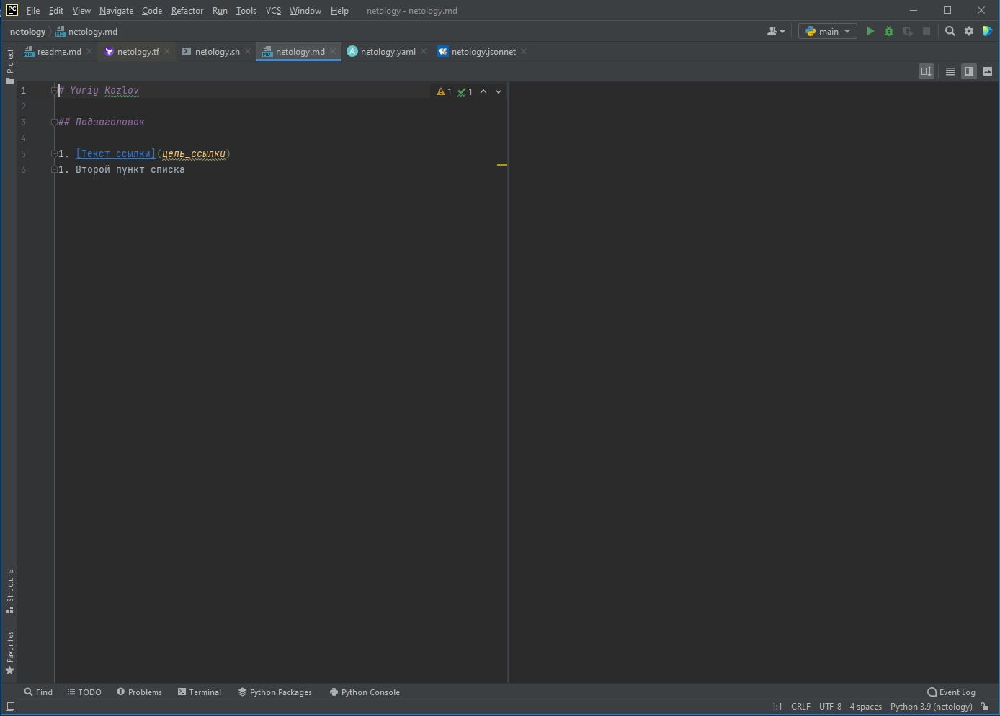

# netology Yuriy Kozlov
## [Netology devops course](https://netology.ru/profile/program/dvpspdc-2/schedule/all)

Задание №2 - `Описание жизненного цикла задачи` (разработки нового функционала)
1. Получение ТЗ от заказчика и обсужение различных технических моментов
2. Разработка: 
2.1 Планирование работы, выбор инструментов, обсуждение функционала
2.2 Написание кода, тестирование в различных тестовых средах
3. Интеграция в рабочую среду 
4. Выбор и построение инфраструктуры под проект
5. Различное тестирование(юнит, функциональное и интеграционное) финального кода
6. При успешном тестировании выкладка в продакшн, при неуспешном доработка и повторное тестирование

Картинка с файлом tf

Картинка с файлом jsonnet

Картинка с файлом yaml

Картинка с файлом sh

Картинка с файлом md
